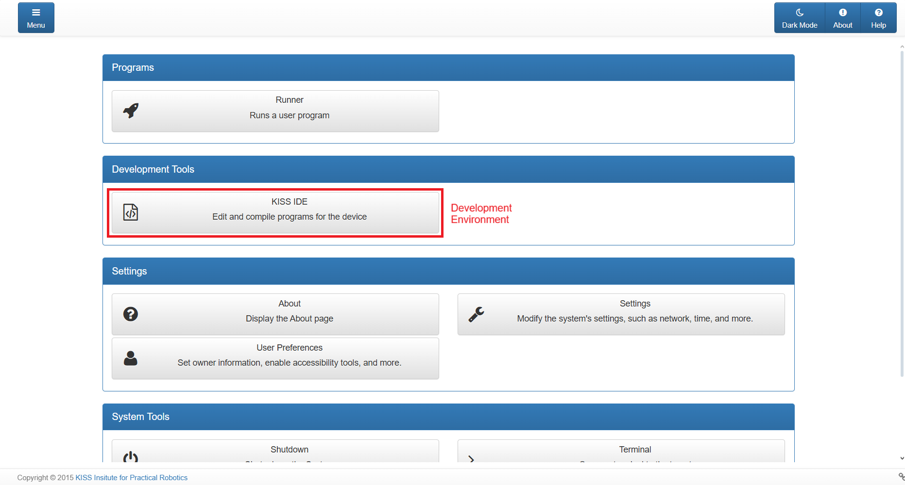
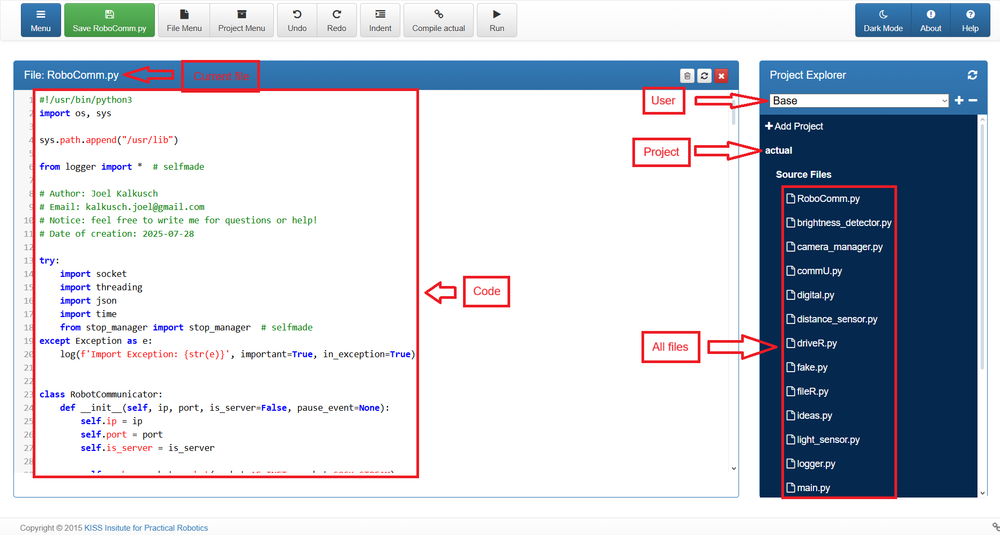
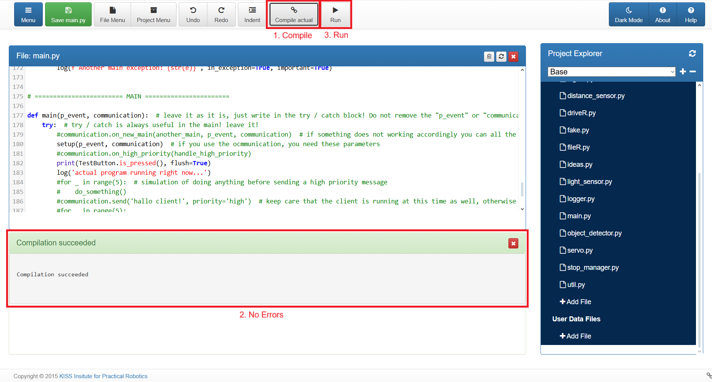

# Getting Started

Welcome, this document is an introduction to the BotBall Event. This file will cover the complete basics of the competition itself – the rules, structure, and general concepts – without going into the specifics of using my library.  

If you are new to BotBall and want to understand the event before working with the code, this is the right place to start.

This website [ECER | Documents](https://ecer.pria.at/documents) could be important for you, since everything is listed here. This will be your best friend at some point

This file is created on the: <u>22. September 2025</u>
Consider this since it could be that some things are deprecated!

---

## 1. Preparation

Before you start, consider that you have access to the following points:

- At least one controller (wallaby / wombat / ...)

- Internet connection (in the beginning, so you can read the documentations)

- A PC for programming

- Sensors and maybe LEGO or metal parts, so you can design hardware

---

## 2. Hardware

- Check out the available parts in the parts lists ([Electronics](https://ecer.pria.at/documents/2025/botball/parts-lists/2025%20Electronics%20Kit.pdf), [Metal](https://ecer.pria.at/documents/2025/botball/parts-lists/2025%20KIPR%20Metal%20Parts%20v1.1.pdf) and [LEGO](https://ecer.pria.at/documents/2025/botball/parts-lists/2025%20Lego%20Parts.pdf)). These are the websites for 2025! Watch out for deprecation!

- Some things you are able to use which are not listed in those parts are listed in the game rules, so you need to consider them as well

- All things considered, your imagination has no boundaries for building and / or adding the Hardware to the controller, as long as you are following the rules and are not exceeding the allowed parts for usage

- **HINT**: it is useful to write a parts list on you own where you can see which parts are used and how often they are used

---

## 3. Software (programming)

1. Plug in and turn on the controller

2. Once it booted, you can either go to the fourth step (**4. Controller - Explanation**) or follow along this third step

3. Make sure your PC is in the same wifi as the controller

4. Get the IP-Adress of the controller (in this example I will use the `192.168.0.10` IP-Adress)

5. Open your browser

6. Type in the IP-Adress of the controller alongside the Port `8888`. In conclusion, the URL has to look like this: `192.168.0.10:8888` 

7. Afterwards you will get to the website that looks something like this:
   
   

8. To start programming look for the "KISS IDE" button and press it.

9. In the new window you are able to change the user, project and the code
   
   

---

## 4. Running a program

1. `Compile` the program

2. Make sure, there are no Exceptions / Errors

3. Press the `Run` button

**HINT**: a very common error in python (at least in the KISS IDE) is the `TabError` or `inconsistent use of tabs`. This is because the KISS IDE distinguishes between using 4 spaces or one tab. Normally this does not matter but unfortunately in the KISS IDE it does.

---

## 5. Playthrough

Since the day of the creation of this file the entire tournament is split into a few main categories. Every category is important for scoring points therefore you should always try your best. Short story time for evidence: My team was the second best team (overall) in ECER, but since our team did not submit the paper, we got placed in the third place overall - even though we beat the official second place overall 4 out of 4 times when playing against each other. 

These (at this time) four categories of scoring points are unequally destributed: 

- **Seeding**: Score as many points as possible on one game table side without an opponent

- **Double Elimination**: Get more points on one game table side than your opponent

- **Paper**: Pre-scientific document about something related to robotic / MINT / ...

- **Documentation**: Is separated into three categories. (Typically word document or video)
  
  - Team Management
  
  - Goals / Tasks
  
  - Construction of robots

---

## 6. Next steps

- Try out sensors. Only with sensors you are able to consistently complete tasks

- If you want to code in python, then feel free to read my documentations so you get an idea of how I solved some problems. Also you sure are allowed to use my library as much as you wish. 

- A team member of mine created a VSCode Extension. His name is Markus Weberndorfer and [this](https://marketplace.visualstudio.com/items?itemName=markusweberndorfer0.kipr-wombat-vscode-extension) is the Extension's link. This could make your life easier in programming

- **Do not be scared** of editing my code. No one is perfect, neither am I, so I also can make mistakes. Also, if something is deprecated many things will not work anymore, so it is in your hands to create a new solution

- **Do not be scared** of adding new classes / code / software / interfaces /... 

- **Do not be scared** of creating hardware

- **Do not be scared** of failure. Failure is the first step to success 

- **Do not be scared** of anything. It is an event for having fun, competing with other teams and establish connections between other people. Everyone is beginning the same, has the same problems. The only difference is how you handle failure and how to solve certain problems. 
