# Considerations for the programmer

This file tells you, as the programmer, things you have to consider. This is only necessary if you are using my library (would help you out a lot.).

You do not have to use my library, but I would suggest to use it, since it already includes logic you do not need to think about. Also, if something does not work on the library, it is easier to figure out what's wrong and tell (if you are not competing alone) the other team about a solution to a problem that might occurred. It would also help future generations of having a better and easier time.

The [advanced](#Adcanced) section is very advanced, so if you got any questions, feel free to ask me on my email: kalkusch.joel@gmail.com

 

# Basics

## The way driving works


#### drive-functions

You can look at the [kipr motor function page](https://www.kipr.org/doc/group__motor.html) to see every function kipr provides. My library uses:

```python
k.mav(motor: int, velocity: int)
```

###### where

- `k` is the imported library from kipr
- `motor` is the port of the motor which has to be moved (like: 0; 3; 1; 2)
- `velocity` is a integer value from -1500 to 1500

---

You can also use the

```python
k.motor(motor: int, percentage: int)
```

###### where

- `k` is the imported library from kipr
- `motor` is the port of the motor which has to be moved (like: 0; 3; 1; 2)
- `percentage` is a integer value from -100 to 100

---

#### drive-sleeps

No matter which function you choose for driving, you still need to implement one of those function (explanation comes after the function explanations):

``` python
k.msleep(time: int)
```

###### where

- `k` is the imported library from kipr
- `msleep` is the function provided of kipr
- `time` is representing **milliseconds** as an integer value

---

Or another way (in python) is using the `time` library:

```python
time.sleep(seconds: float)
```

###### where

- `time` is the imported library
- `sleep` is the function provided by the time module
- `seconds` is the time in **seconds** you want to wait

---

##### Explanation

No matter which you choose (I simply prefer `k.msleep`, because since this is from kipr they are responsible for their functions to work), you need to either implement those functions for static amount of time for movement or you need to wrap the movement functions around a loop.

This is because if you are only telling the program to drive, without telling it how long to drive, it will only execute for a very short amount of time. The time will be so short that you will not even notice it. That is why you need to tell it some time for the human eye to see a change. 

---

#### drive-adjustments

At the time you get comfortable with the drive functions (with the sleeps), then you will notice - when you are driving forward or backward - that the robot will have make a massive turn to the left or right. You can weaken / remove the curve by implementing so called adjustments. You can know how in which way you curve by using the gyro. It will help you a lot to know how the gyro works (e.g. this [link](https://science.howstuffworks.com/gyroscope.htm) can help).  

The combination of gyro and driving works as follows: When driving for some time you need to get a value which could look like this:

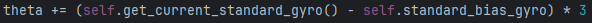

###### where

- `get_current_standard_gyro()` returns the gyro z or gyro y value, depending on if the controller is standing or laying flat on the ground
- `standard_bias_gyro` is a calibrated gyro bias to know how much off the gyro actually is
- `*3` is to make it higher, so the thresholds get reached easier, resulting in a cleaner drive-path

Using this kind of logic, a drive straight function can look something like this:

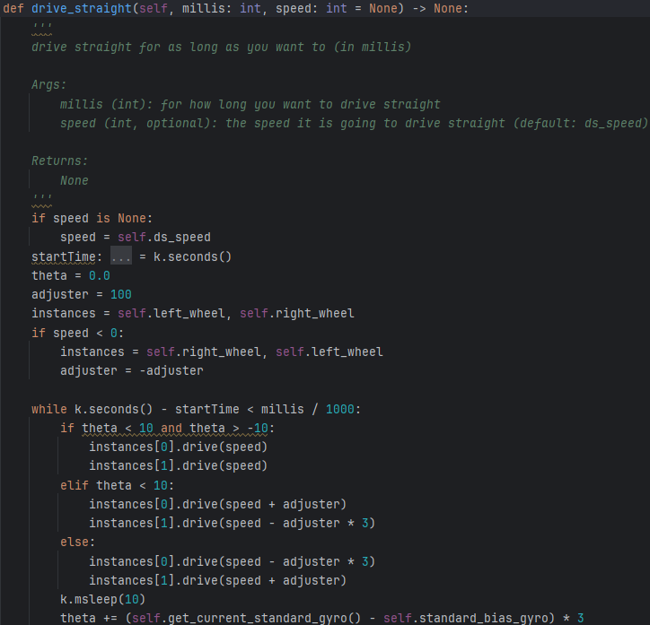

notice that the adjuster reduces / increases the speed to drive more straight

## The way servos work

Servos work very similarly to motors. Kipr also provides functions [on their website](https://www.kipr.org/doc/group__servo.html), you can go there to see the possibilities of using servos

#### servo-functions

If you want to move a servos, you first need to enable them (you can practice that on the controller by the way) by using

```python
k.enable_servo(port: int)
```

###### where

- `k` is the imported library from kipr
- `enable_servo` is a function provided by kipr
- `port` is an integer value (e.g. 1; 4; 2; 3) representing the location on the controller where you plugged the servo in

You need to enable them to be able to move them. A disabled servo will not move, not matter which value you set it to. After you enable it, you can move it by using

```python
k.set_servo_position(port: int, position: int)
```

###### whered

- `k` is the imported library from kipr
- `set_servo_position` is a function provided by kipr
- `port` is an integer value (e.g. 1; 4; 2; 3) representing the location on the controller where you plugged the servo in
- `position` is a integer value between 1 - 2047. This represents the absolute position of where the servo has to go

To save some battery and to avoid mis-usage of servos, it is smart to disable them after quite some time. You can disable them by using

```python
k.disable_servo(port: int)
```

###### where

- `k` is the imported library from kipr
- `disable_servo` is a function provided by kipr
- `port` is an integer value (e.g. 1; 4; 2; 3) representing the location on the controller where you plugged the servo in

---

#### servo-sleeps

The servos need - just like the motors - some time to "act". If you give them no / too little time to adjust, then they will either not move at all, or move too less. That is why you will also need one of these functions:

``` python
k.msleep(time: int)
```

###### where

- `k` is the imported library from kipr
- `msleep` is the function provided of kipr
- `time` is representing **milliseconds** as an integer value

---

Or another way (in python) is using the `time` library:

```python
time.sleep(seconds: float)
```

###### where

- `time` is the imported library
- `sleep` is the function provided by the time module
- `seconds` is the time in **seconds** you want to wait


# Advanced

## Considerations about using motors in threads

### The threadsafe-time problem

##### Explanation

Maybe you find a way to fix this, but as of now, if you are getting inside a thread or use the `high priority` / `new main` priorities in communication, then you need to stay inside the new thread for at least 500 milliseconds. This is due to how the motor_scheduler (inside the `motor_scheduler.py` file) works, more specifically the ID generation. This is because it is hard to predict whether you are just waiting for 500 milliseconds inside the same thread and another thread gets ended very fast. Another reason that you need to stay inside the same thread (if you use the motor inside the short-lasting thread) for (at least) 500 milliseconds is, because starting a thread is very inconsistent. Sometimes the thread starts 200 milliseconds later other times the thread starts after only a few milliseconds later and in the worst case it can take longer than 200 milliseconds. As a baseline I took 500 milliseconds since I found it the most consistent to work.

##### Example

###### TRY TO AVOID THINGS LIKE THESE (every new picture is another way of how to not to do it):

---

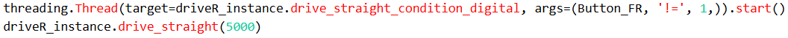

Reason: When entering the thread there is a small chance that the button is already pressed (time in thread < 500 milliseconds) 

---

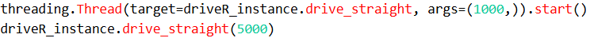

Reason: When entering the thread it will immediately get out of the thread, even though inside of the thread you are telling the `drive_straight` function to be inside of the function for 1000 milliseconds. Threads in python start the function immediately and afterwards it will get into the `drive_straight` of the `driveR_instance` for 5000 milliseconds (in less than 500 milliseconds) -> too short

---

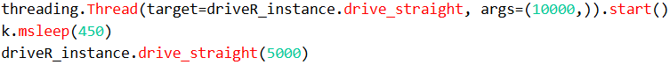

Reason: Same as the above, even though you tell it to stay in it for 10000 milliseconds inside the thread and even after 450 milliseconds of waiting, there is still a chance of it taking less than 500 milliseconds. This is because the thread immediately exits itself and runs in the background (this is how threads work)

---

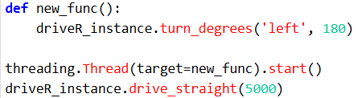

Reason: Creating an entire new function and calling it inside of the thread does not change anything. This is just like the above, you could so to say just write this inside the same line instead of creating a new function. In a nutshell: It get's into the function and exits immediately, even though `turn_degrees` is not even finished. This results in the thread getting switched in less than 500 milliseconds. 

---

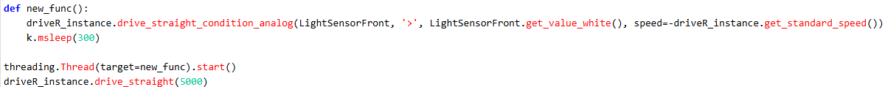

Reason: Even if the function is very long, this never means that it takes long to execute. Also there is a chance that the condition is already met in the same second. This could lead to the thread taking less than 500 milliseconds (even though you specifically say to wait for 300 milliseconds)

---

##### Conclusion

Try to use one of these ways when you want to use threading and there is a chance of leaving the thread early / too early:

static waiting time:

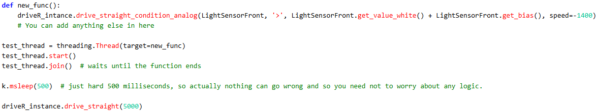

dynamic waiting time:

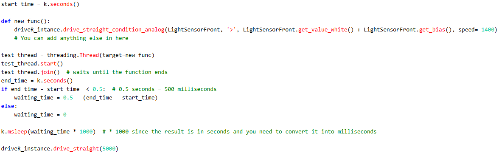

Notice that in both functions is the `.join()` function. This makes it so it waits until the function is finished. When you are just driving forward for a static amount of time, then there is no need to `.join()` since the program will remember how long you told it to drive. As said, this only works when using function like `drive_straight()` or `turn_degrees()` (file: driveR.py), since they need a static amount of time to drive. When not using the `.join()` function it will immediately leave the function and get to the next function outside of the thread (more on that in https://www.tutorialspoint.com/python/python_joining_threads.htm). 

##### Why this works

All of these ways work because of the way I wrote my library (`motor_scheduler.py`):

- It will generate a new ID if 500 milliseconds are between DRIVING (using the `driveR.py` file and / or `wheelR.py`) in two different threads. If you do something in a thread which is not driving, then those 500 milliseconds **can be ignored**
- You can use the `.join()` method of the `threading` module to wait for the thread to finish
- You can implement a time counter so you definitely stay inside the function for at least 500 milliseconds

The `motor_scheduler.py` file basically listens to the last call of driveR instance. It will execute what the driveR tells the WheelR and afterwards the WheelR calls the MOTOR_SCHEDULER to basically tell it "I got a new call to drive with the speed of X on the port Y". Then the MOTOR_SCHEDULER looks if it is a new thread or an existing thread and therefor giving it an ID. If the time of two calls is less than 500 milliseconds, then it will not create a new ID, which results in not creating a new ID.

Note that all of this is **ONLY NECESSARY** if you are driving in thread1, getting inside of thread2 and drive there are well and when in less than 500 milliseconds you want to return to thread1 to drive again with a diffrent function. thread1 can be the main thread. If you are not driving in thread2, then all of this does not need to be considered! All of this does also not need to be considered, if you are getting from thread1 - thread2 - thread3. New threads will ALWAYS overwrite each other. It will not overwrite each other if you are returning to a thread and the last call of the thread you want to recall was less than 500 milliseconds   

---

### The no-drive-command problem

##### Explanation

Sometimes you are driving in a thread and want to exit it earlier (you were still longer inside of the thread than 500 milliseconds) than you told the driver to return to the main thread. Afterwards you need to keep care about the very next function after you exit the thread. If there is no call of a drive function (or for stopping the motor), then the function will keep running in the background until either the time gets reached when you told it to end or until the next call of another driving function. 

##### Example

If the next function you are calling looks something like this: 

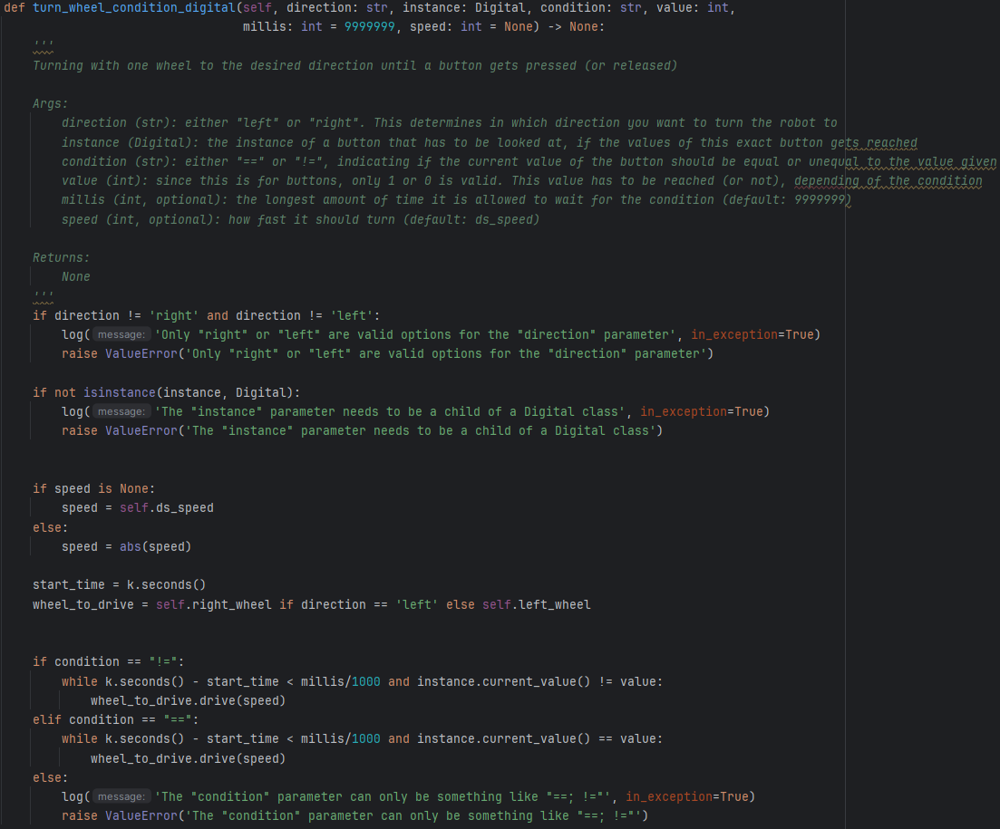

more specifically here:

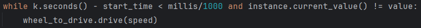

Then there is a chance that the button you want to reach a certain value is already on the wanted value. If this occurs, then the robot will not drive, resulting in the last command still executing. If you were in a thread the last time, then it will still execute the drive command of the thread. Most of the times this is very bad, so you have to come up with an idea of how to avoid this problem. There are two ways to avoid this.

1. At the time you want to exit a thread and you want to overwrite the last command, simply do anything that you know for sure make the robot drive. For example writing `{driveR_instance}.drive_straight(10)`, this makes it so it will definitely drive, resulting in the last (in thread) command ending / getting overwritten

2. All of **my own created functions** have a line like this: 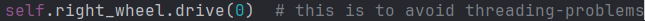

   this makes it so t will force the program to overwrite the last command, even without actual driving (speed 0 means stand still). Therefor the last function i showed you now looks like this:

   

​	Notice that before it could happen that the values are already reached, then it was still overwritten by the 0 speed command

##### Conclusion

If you are writing your own functions inside of the driveR class, then consider writing this line:


(on other robots the wheel name will change, but the logic stays the same) before a loop where there is a chance of a value already reached. This makes it so if you are exiting a thread, while you are driving inside of this thread, that you overwrite the last driving command

##### Why this occurs

As previously stated, this has something to do with how threads work and how I wrote the `motor_scheduler.py` file. This file basically listens to the last call of driveR instance and then executes what the driveR tells the WheelR and afterwards the WheelR calls the MOTOR_SCHEDULER to basically tell it "I got a new call to drive with the speed of X on the port Y". Then the MOTOR_SCHEDULER looks if it is a new thread or an existing thread and therefor giving it an ID. The newest ID overwrites the last ID, but if there is no call of driving (if a wanted value is already reached), then it will never create a new ID, resulting in the newest ID being the last. By forcing the program to tell it to drive at 0 speed, it will create a new ID (if you are still within the 500 milliseconds) and afterwards overwriting the last ID, even though the value is already reached.

