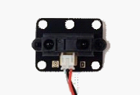
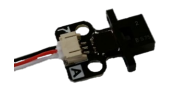

# Robot Sensor System Documentation

## 1. Sensor Overview

- Analog
  
  - Distance (ET)
  
  - Light
  
  - Brightness (Tophat)
  
  - Linear Slide

- Digital
  
  - Touch
  
  - Lever

- Motor

- Servo

---

## 2. Details

### 2.1 Analog

##### 2.1.1 Distance Sensor (ET)

The distance sensor returns a value between `200` - `2900`. The value it returns depends on some factors (at least from what I noticed):

- distance

- temperature

- light

This sensor is unfortunatelly very unreliable, so keep care when using it! It works great on distances between `100` - `800`mm. Everything above 800mm will not be recognised and everything below 100mm is very inconsistent and is very hard to balance.  

##### 2.1.2 Light Sensor

The light sensor returns a value from `1000` - `3100`. The value it returns depends on one factor:

- light - brightness

This sensor is reliable. It is works best for light emitting sources, like a lamp. This is great for the start of the game. Theoretically it could be used as a brightness sensor, but with less bias between the top and low threshold. 

##### 2.1.3 Brightness Sensor (Tophat)

 

The Tophat sensors (small and large) return a value from `200` - `3700`. The value they return depends on one factor:

- Greyscale of the ground where the sensor faces

There is not really a difference between the small and large Tophat sensors. From what I noticed the only difference is the area which gets scanned. 

##### 2.1.4 Linear Slide

The linear slide returns a value from `0`  - `2047`. The value it returns depends on one factor:

- The position of the slider (the further away from the cable the higher the value)

Unfortunatelly you can not set the value, you can only receive the value it is at the moment

---

### 2.2 Digital

##### 2.2.1 Touch

The small and large Buttons return the values `0` or `1`. The value it returns depends on one factor:

- If it is pressed, it returns `1`, otherwise it returns `0` 

You should keep care a bit on the large Touch sensor, since if it is pressed from the side, it is counted as pressed.

##### 2.2.2 Lever

The Lever returns the values `0` or `1`. The value depends on one factor:

- If it is pressed, it returns `1`, otherwise it returns `0`

The last years you were able to bend the the metal, which made. You also need to be careful to not crush the metal piece, since it is not very durable

---

### 2.3 Motor

The motor is very diverse. It can move 360 degrees in a loop. You can use them for something simple just as driving and for something advanced like an arm. You can receive and set the value in ticks / velocity / ... . They are not really depending on a factor, but something you need to keep care about is the following:

- If you are using it for an arm you will encounter the problem that sometimes it will not move (even if the arm is not too heavy for lifting). This is due to how the initial source code is written. It is highly inefficient with a lot of time of waiting time. If you control the motor in this time of "maintenance" it simply will not move. You can try to fix this issue yourself   

---

### 2.4 Servos

##### 2.4.1 Servo

The servo is great for using it as an arm or claw. It can move 180 degrees. It is not really dependant on anything. It is very consistent and I did not encounter any problems with those. You can receive and set the value of a servo very accurately.

#### 2.4.2 Micro Servo

The micro servo is not that consistent. It is very important to consider the following:

- Even though you are able to set the value very high, you should not do this, since otherwise it will break. Since it is still a servo, it can move 180 degrees.

You are able to receive and set the value, just as the normal servo, since it uses the same functions. **HINT**: If you are using my library, you can just set the min and max value and from there on you are not able to exceed the numbers.
