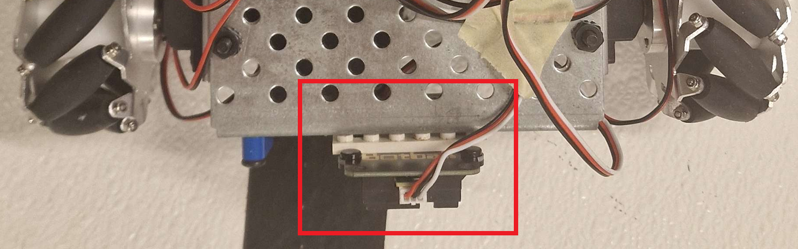

# Robot Construction Template – Sensor Placement Focus

## 1. Sensor System Overview

- **Analog**
  
  - Distance Sensor
  
  - Light Sensor
  
  - Brightness Sensor

- **Digital**
  
  - Button 

---

## 2. Sensor Positioning Principles

- **Light Sensor**: Starting of the program

- **Distance Sensor**: detecting distances in front of the wombat

- **Brightness Sensor**: Line follow and line detection

- **Buttons**: Bumping into (e.g.) pipes for alignment

---

## 3. Sensor Placement Details

### Standard Orientation (Top View)

In this example the robot is facing downwards. It does not matter if the controller is standing or laying. It also does not matter how many wheels the robot has. You can orientate yourself always on where the front of a robot is by searching for the distance sensor:

 

##### Brightness Sensor (Tophat) - Bottom View

- **Positions**:
  
  

- **Justification**:
  
  - <u>Tophat</u>: They are positioned in the front and rear of the wombat for the line follower and line detection. They positioned symmetrically, one at the front and one at the rear for optimal results for the line follower
  
  - <u>Small tophat</u>: This is mainly for detecting a horizontal line when the robot is already following a line
  
  - The tophats should be as low as possible, but they should not scratch the ground. If they are positioned too high, then the values are more inaccurate (since the sensor can not detect the difference between white and black as precise). If they are too low, they will scratch the ground and may get damaged. Also consider the shadow the robot casts onto the tophats.

##### Distance Sensor (ET) - Bottom View

- **Position**:
  
  

- **Justification:**
  
  - It is placed there because it is important to know what happens in front of the robot. It would be the best if it is above the "unwanted" obstacles like the pipes.

##### Light Sensor - Top View

- **Position**:
  
  

- **Justification**: 
  
  - It honestly does not matter where it is placed, as long as the lamp on the game table can reach it, so the program can start

##### Button (Touch)

- **Positions**:
  
  ###### Front (Front - back view)

  
  
  ###### Rear (Back - bottom view)
  
  
  
- **Justification**:
  
  - The type of buttons do not really matter. You can choose the small touch or the large touch. The large touch are a little bit better, because on the mecanum wheels It is a little bit better since the buttons are larger and therefor the robot (with mecanum wheels) does not slide as much against the pipes when it aligns. If the mecanum wheels are not allowed, then on the rubber wheels it does not matter. The buttons need to be the furthest extended point in the front and rear of the robot.
